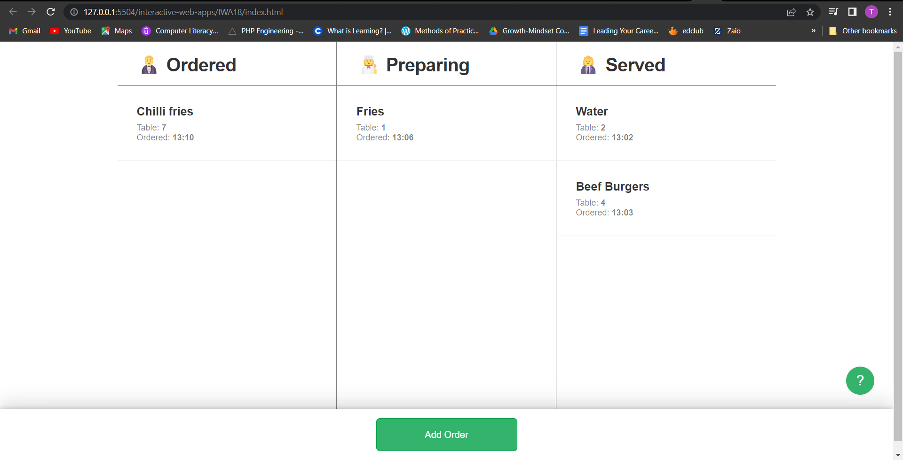

# Kitchen Express IWA_18.4 

## Table of contents
- [Kitchen Express IWA\_18.4](#kitchen-express-iwa_184)
  - [Table of contents](#table-of-contents)
      - [user stories are met:](#user-stories-are-met)
    - [Link to GitHub file](#link-to-github-file)
    - [The file is created with:](#the-file-is-created-with)
        - [Line 1 and 2 from ***scripts.js***](#line-1-and-2-from-scriptsjs)
  - [The rendered output looks like this:](#the-rendered-output-looks-like-this)

> 👩🏾‍💻 I had to modify the *scripts.js* file, where most of the event-specific behaviour is located. All event listeners and handlers have been created already. However, only the first handleDragOver handler’s logic has been written and documented. I was required to add the logic for all remaining event handlers (making use of the *data.js* and *view.js* file exports) to ensure that the following 
#### user stories are met:
> 
>>    - The “Add Order” button should start as focused, meaning space enter can be pressed immediately to add an order.
>>    - Click the “?” icon should open a “Help” overlay that provides instructions on how to use the app.
>>    - If the “Help” overlay is open, clicking the “Close” button should remove the overlay.
>>    - If any overlay is closed the focus should be returned to the “Add Order” button.
>>    - Clicking “Add Order” should open an “Add Order” overlay that allows the entering of order text and an associated table.
>>    - Clicking “Cancel” in the “Add Order” overlay should remove the overlay without adding the information as an order.
>>    - Clicking the “Add” button in the “Add Order” overlay should remove the overlay and add a new order to the “Ordered” column.
>>    - If the “Add Order” overlay is closed (either with “Cancel” or “Add”) and it is opened again it should be blank (not have information from the last time it was opened).
>>    - If an order has been added and it is clicked on the “Edit Order” overlay should appear.
>>    - If the “Delete” button is pressed in the Edit Order overlay the overlay should be closed and the order should be removed entirely.
>>    - If the “Cancel” button is pressed in the “Edit Order” overlay it should close the overlay without applying the changes entered into the overlay inputs.
>>    - If the “Update” button is pressed in the “Edit Order” overlay it should close the overlay and apply the changes entered to the relevant order.
>>    - If the “Status” value is changed and “Update” is pressed in the “Edit Order” overlay then the order should be moved to the column selected in the dropdown.
>

### Link to GitHub file

🔗 Here's the link to the [file's Github](https://github.com/Ato-Mothibi/interactive-web-apps.git).

### The file is created with:

1. HTML 
2. CSS
3. JavaScript: 
    - data.js
    - scripts.js
    - view.js

##### Line 1 and 2 from ***scripts.js***

        import { COLUMNS,state,updateDragging,createOrderData,TABLES} from "./data.js";
        import {createOrderHtml,html, updateDraggingHtml,moveToColumn} from "./view.js";   

Shows that I imported objects from other 2 scripts.

## The rendered output looks like this:

